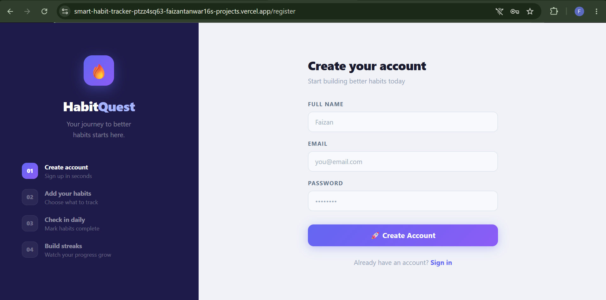
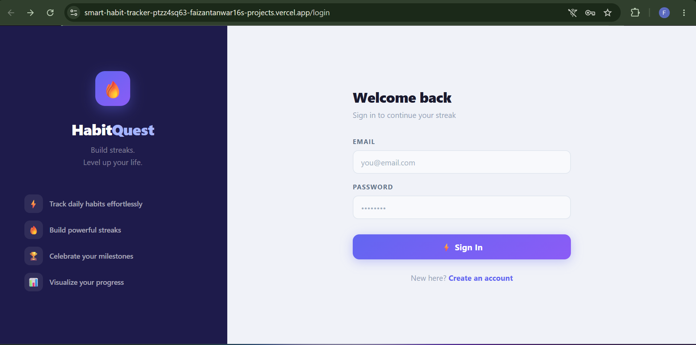
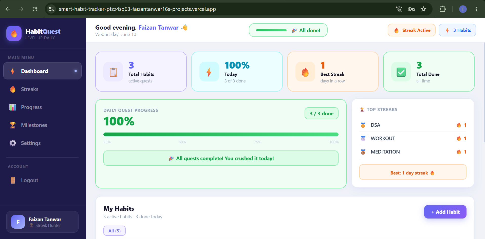
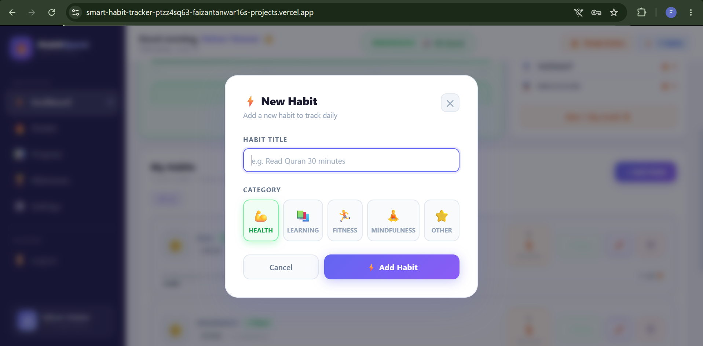

# Smart Habit Tracker

A full-stack MERN application that helps users build and maintain habits through streak tracking, progress monitoring, and milestone achievements.

## 🚀 Live Demo

Frontend: https://smart-habit-tracker-three-roan.vercel.app

Backend API: https://smart-habit-tracker-1.onrender.com

## Features

* User Authentication (JWT)
* Secure Password Hashing (bcrypt)
* Create, Update, Delete Habits
* Habit Completion Tracking
* Streak Calculation System
* Dashboard Analytics
* Milestones & Achievements
* Responsive UI

## Tech Stack

### Frontend

* React
* Vite
* React Router
* Axios

### Backend

* Node.js
* Express.js
* MongoDB Atlas
* JWT Authentication
* bcryptjs

## Installation

### Backend

npm install

npm run dev

### Frontend

npm install

npm run dev

## Screenshots

### Register Page

### Login Page

### Dashboard

### Add Habit Modal

## Author

Faizan Tanwar
